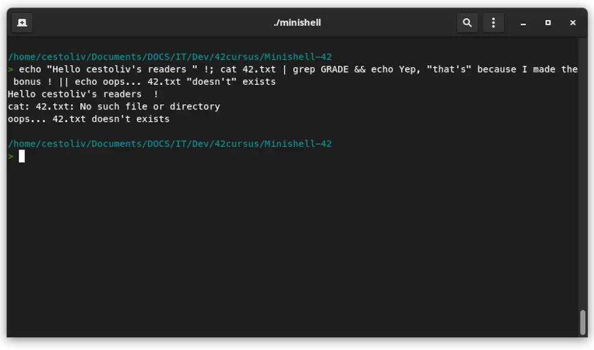

# Minishell

```
FINAL GRADE: 111/100
```

Long project in a group of two, the goal is to create a command interpreter that mimics the behavior of bash. Minishell manages environment variables, launches programs and handles their return. We also have a number of built-in functions, like cd, echo, env, exit, export, pwd and unset.


*Screenshot of minishell*

## Build & start

Just run a make:

```bash
make
```

You can then run the program:

```bash
./minishell
```

### MacOS
On MacOS, you first need to install `readline`:
```bash
brew install readline
```
The return of `brew info readline` will give you an `LDFLAGS` and a `CPPGLAGS` to export to achieve the build :
```bash
export LDFLAGS="-L/usr/local/opt/readline/lib"
export CPPFLAGS="-I/usr/local/opt/readline/include"
```
(you can add the values, without the `export` keyword, at the top of the `Makefile` to make it permanent)
